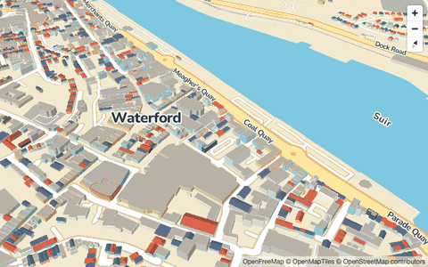

# toytown-gl

**Turn OpenStreetMap into a cartoony toy town, anywhere in the world.** A drop-in plugin for
[MapLibre GL JS](https://maplibre.org/) that draws a friendly base map, procedural toy buildings
for every OSM footprint, and a reusable kit of low-poly models for houses, shops, pubs, schools,
churches and more.



> **Status: early development.** Nothing is published to npm yet; phase 7 publishes `v0.1.0`.
> The demos are Waterford City and Tramore, Ireland, but nothing in the plugin is specific to
> them.

## What you get

- **A cartoon base style**: warm palette, fat round roads, rounded labels (Nunito), over free
  OpenFreeMap tiles with no API key.
- **Every building, as a toy**: footprints extruded with gable or hip roofs, parapets, window
  strips and ink outlines. Wall colours come from each category's palette, including Irish
  terrace colours.
- **Hero models where they fit**: 31 low-poly CC0 models plus variants, matched to buildings by
  OSM tags. Where a model doesn't fit, the building gets props instead: awnings, spires, a red
  cross, a petrol canopy.
- **Trees**, from mapped trees and seeded scatter in parks.
- **Themes**: `default` and `night` (glowing windows). Themes are JSON, so you can recolour the
  whole kit.
- **Fast**: meshing in Web Workers, one draw call per chunk, instanced models, levels of detail by
  zoom, and lazy loading. See [performance](docs/performance.md).

## Quick start

**1. Build a data file for your area** (any bbox in the world, from Overpass, or from a PBF
extract) with the CLI in this repo:

```sh
pnpm install && pnpm build
node packages/cli/dist/index.js build-data --bbox -7.17,52.22,-7.05,52.28 --out public/data/town.geojson
```

**2. Add it to a MapLibre map:**

```ts
import maplibregl from 'maplibre-gl';
import 'maplibre-gl/dist/maplibre-gl.css';
import { ToyTown } from 'toytown-gl';

const map = new maplibregl.Map({
  container: 'map',
  style: ToyTown.style(), // or ToyTown.style({ theme: 'night' })
  center: [-7.11, 52.26],
  zoom: 16,
  pitch: 55,
});

const toy = new ToyTown({
  data: '/data/town.geojson',
  models: '/models/manifest.json', // the model kit: @toytown/models, or assets/models from this repo
  theme: 'default',
});
toy.addTo(map);

toy.on('click', (b) => console.log(b.category, b.name, b.osm)); // e.g. "church", its name, https://www.openstreetmap.org/way/…
toy.setCategoryModel('hospital', '/models/my-hospital.glb'); // use your own model for a category
toy.addPack('/models/ireland/manifest.json'); // a regional pack: landmark models and overrides
```

The full API is in [docs/api.md](docs/api.md).

## Add your own model

Models are GLB files: Y-up, in metres, front facing +Z, origin at the base centre, one material
per palette key. You can:

- swap one in at runtime with `toy.setCategoryModel(category, url)`;
- add it to the kit (generated, made in Blender, or from Kenney or Quaternius) with
  [docs/adding-models.md](docs/adding-models.md);
- put region-specific models and landmarks in a pack (`<pack>/pack.json`, `landmarks.json`).

The kit is also published separately as [`@toytown/models`](packages/models/README.md) (CC0),
for use in three.js, Babylon.js, Unity or Godot.

## Improve the tag mapping

Which model a building gets comes from `assets/models/tag-map.json`: rules with priorities, tag
and size conditions, POIs inside footprints, and heuristics. Run `pnpm data:build`, read
[docs/classification-report.md](docs/classification-report.md) for the most common unmapped tag
combinations, and add rules. See [docs/tag-mapping.md](docs/tag-mapping.md).

## Documentation

- [API](docs/api.md)
- [Base style](docs/style.md)
- [Building data (`toytown build-data`)](docs/build-data.md)
- [Tag mapping](docs/tag-mapping.md) and the [classification report](docs/classification-report.md)
- [Procedural buildings](docs/buildings.md)
- [Rendering: toon shading, hero models and trees](docs/rendering.md)
- [Performance and levels of detail](docs/performance.md)
- [Adding models](docs/adding-models.md) and the kit package, [`@toytown/models`](packages/models/README.md)
- [Contributing](CONTRIBUTING.md)

## Repository layout

```
packages/core        the library (published as `toytown-gl`)
packages/cli         `toytown build-data`: fetch and classify OSM buildings
packages/models      `@toytown/models`: the model kit as its own npm package and zip
assets/models        the model kit: GLBs, manifest.json, tag-map.json, regional packs
assets/generator     procedural model generator (Python)
examples/waterford   Waterford City demo
examples/tramore     Tramore demo
docs/                documentation
```

## Development

You need Node 22.12+ (see `.nvmrc`), pnpm 12, Python 3.9+ for the model generator, and Docker
for the screenshot tests.

```sh
pnpm install
pnpm build          # packages and examples
pnpm test           # unit tests, including glTF validation of the model kit
pnpm lint
pnpm test:e2e       # Playwright screenshot tests, in Docker (matches CI)
pnpm data:build     # rebuild the example datasets and the classification report
pnpm --filter @toytown/example-waterford dev    # then open with ?debug for the FPS overlay
```

To regenerate the model kit:

```sh
python3 -m venv .venv && .venv/bin/pip install -r assets/generator/requirements.txt
.venv/bin/python assets/generator/generate_models.py
.venv/bin/python assets/generator/check_reproducible.py
```

## Attribution and licensing

- **Code** is [MIT](LICENSE).
- **Models** in the kit are [CC0](assets/models/LICENSES.md). Contributed models must be CC0 or
  CC-BY.
- **Map data** is © OpenStreetMap contributors, under the
  [Open Database Licence (ODbL)](https://www.openstreetmap.org/copyright). Any map using
  toytown-gl **must show "© OpenStreetMap contributors"** (the base style's source does this).
  Building datasets you derive from OSM, such as the output of `toytown build-data`, are ODbL
  derivative databases: if you publish them, share them under the ODbL. The example datasets in
  `examples/*/public/data/` are ODbL.
- **Tiles and glyphs**: base tiles come from [OpenFreeMap](https://openfreemap.org/) by default,
  and label glyphs (Nunito, SIL OFL) from [VersaTiles](https://versatiles.org/).

## Roadmap

- [x] Cartoon base style, building data pipeline, procedural buildings, toon rendering, hero
      models, props, variants, LOD, day and night themes, click events
- [ ] Publish `toytown-gl` and `@toytown/models` to npm (ESM + UMD), and attach a models zip to
      releases (phase 7)
- [ ] Measure on real mid-range laptops and phones, then add a DPR cap and distance LOD if needed
- [ ] More variants and regional packs (Contributions welcome!)
- [ ] 3D in globe view (currently 3D switches on once MapLibre's globe has blended to flat)
- [ ] A React wrapper, as a separate package
