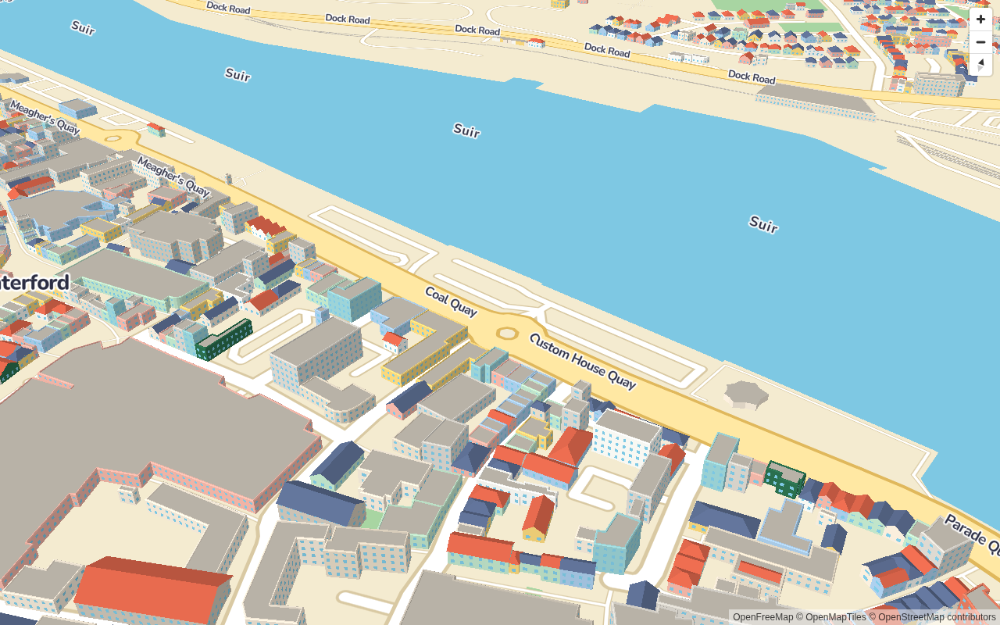

# toytown-gl

> **Status: early development (phase 3: procedural buildings).** Nothing is published yet.



A drop-in [MapLibre GL JS](https://maplibre.org/) plugin that renders OpenStreetMap anywhere in the
world as a cartoony toy town. It has three parts:

- a stylised base map,
- procedural toy buildings generated from every OSM footprint, and
- a reusable kit of low-poly building models (houses, shops, hospitals, schools, churches...) matched
  to buildings by OSM tags.

Waterford City and Tramore, Ireland are the demo towns.

## Repository layout

```
packages/core        the library (published as `toytown-gl`)
packages/cli         `toytown build-data`: fetch and classify OSM buildings
assets/models        the model kit: GLBs, manifest.json, regional packs
assets/generator     procedural model generator (Python)
examples/waterford   Waterford City demo
examples/tramore     Tramore demo
docs/                architecture and design notes
```

## Development

Requires Node 22.12+ (see `.nvmrc`), pnpm 12, and Python 3.9+ for the model generator.

```sh
pnpm install
pnpm build          # build the packages and examples
pnpm test           # unit tests, including glTF validation of the model kit
pnpm lint
pnpm --filter @toytown/example-waterford dev
pnpm test:e2e       # Playwright screenshot tests, in Docker (matches CI)
pnpm data:build     # rebuild the example datasets and docs/classification-report.md
```

To regenerate the model kit:

```sh
python3 -m venv .venv && .venv/bin/pip install -r assets/generator/requirements.txt
.venv/bin/python assets/generator/generate_models.py      # rewrites assets/models
.venv/bin/python assets/generator/check_reproducible.py   # checks the committed kit is reproducible
```

## Documentation

- [Base style](docs/style.md)
- [Building data (`toytown build-data`)](docs/build-data.md)
- [Procedural buildings](docs/buildings.md)
- [Tag mapping](docs/tag-mapping.md) and the [classification report](docs/classification-report.md)

## Licensing and attribution

- **Code** is [MIT](LICENSE).
- **Bundled models** are [CC0](assets/models/LICENSES.md). Contributed models must be CC0 or CC-BY.
- **Map data** is © OpenStreetMap contributors, available under the
  [Open Database Licence (ODbL)](https://www.openstreetmap.org/copyright). Any map built with
  toytown-gl must show "© OpenStreetMap contributors" attribution. Building datasets you derive
  from OSM (for example, the output of `toytown build-data`) are ODbL derivative databases and
  must be shared under the ODbL. The example datasets in `examples/*/public/data/` are ODbL.
- Base map tiles come from [OpenFreeMap](https://openfreemap.org/) by default, and label glyphs
  (Nunito, SIL OFL) from [VersaTiles](https://versatiles.org/). See [docs/style.md](docs/style.md).
