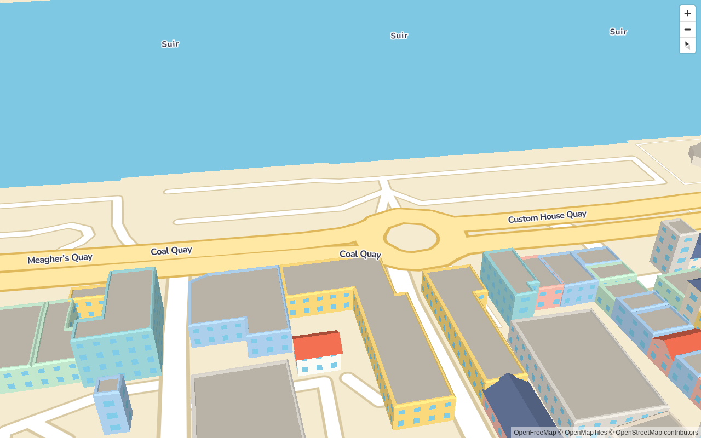
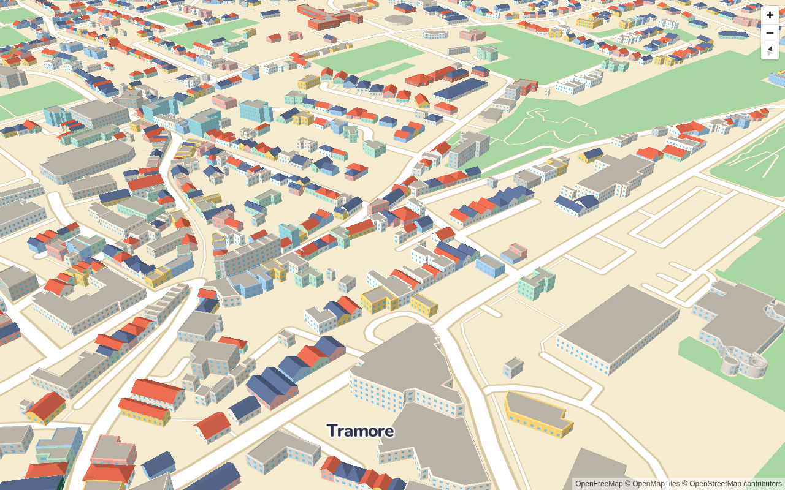
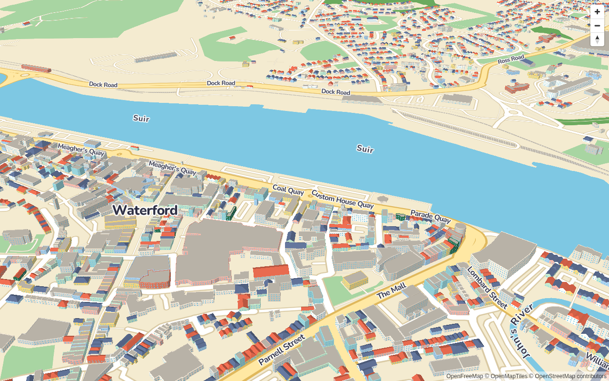

# Procedural toy buildings

Every footprint in a `toytown build-data` file becomes a toy building. Hero models (phase 4) sit on
top of these later.

```ts
import maplibregl from 'maplibre-gl';
import { ToyTown } from 'toytown-gl';

const map = new maplibregl.Map({
  container: 'map',
  style: ToyTown.style(),
  center: [-7.11, 52.26],
  zoom: 16,
  pitch: 55,
});
new ToyTown({ data: '/data/waterford.geojson' }).addTo(map);
```

| Waterford z17                    | Waterford z18.3                    |
| -------------------------------- | ---------------------------------- |
|  |  |
| **Tramore z17**                  | **Waterford z16**                  |
|    |    |

## Geometry (`packages/core/src/geometry/mesher.ts`)

Buildings are meshed in local metres (x east, y north, z up) around a chunk origin.

- **Rings** are cleaned first: the closing point, points closer than 5 cm, near-collinear points and
  zero-area rings are dropped. Outer rings are wound CCW and holes CW, so edge normals always point
  out of the building's material.
- **Walls** are one quad per edge, from the ground to the eaves.
- **Flat roofs**: every category not listed below, and any footprint that isn't rectangular enough.
  - The wall stops `bevel` (0.3 m) below the top. A 45° band leads to a ring inset by the bevel,
    then comes a flat parapet top (`parapetWidth` 0.3 m), an inner parapet face, and a deck
    `parapetHeight` (0.6 m) below the top, triangulated with holes.
  - Insets are mitred (miter capped at 3×) and rejected if the ring flips or collapses. Buildings
    that are too thin or lower than 4 m become plain boxes.
- **Pitched roofs**: only for the categories in `pitchedRoofs.categories` (the residential types,
  `pub`, `church` and `school`).
  - The footprint must be a single part with no holes, filling at least 85% of its minimum rotated
    rectangle (`minRectangularity`). The roof is built over that rectangle with a 0.3 m overhang
    and a soffit.
  - **Pitch** is 35°, capped at 45% of the building height, at 8 m, and at "leave 2.2 m of wall". A
    rise under 1 m falls back to a flat roof.
  - **Gable vs hip** is chosen per building from a hash of its id, using `hipShare`: churches, pubs
    and terraces are always gable, schools always hip, houses about 40% hip.
  - **Gable ends** are wall-coloured triangles in the wall plane.
- **Colours**: the wall colour is a stable hash of the id into the category's wall palette, e.g.
  terraces cycle `#F2B5A7`, `#F6D57A`, `#A9CBE8`, `#BFE3C9`, `#F4E9D8`. The roof colour is a hash
  into `roofs` (`#D9644A`, `#5B6C8F`). Flat decks are `#B8B2A7`.
- **Windows** are not geometry. Each wall vertex carries its position along the edge, its height,
  the edge length and the eave height, and the fragment shader draws a grid of `#7EC8E3` windows:
  one per `windowSpacing` (2.6 m) along the edge, one row per `floorHeight` (3 m), clear of the
  ground and the eaves. Edges shorter than 1.8 m get none. `warehouse`, `barn` and
  `parking_garage` get none, and neither does anything under 3.5 m tall.

All of the above comes from `packages/core/src/themes/default.json`, so a theme can change colours,
roof rules and windows without code changes.

## Chunks and workers

Buildings are grouped by the z15 web-mercator tile of their first vertex (110 chunks for
Waterford). Each chunk is meshed in a Web Worker (`MeshPool`, up to 4 workers) into **one**
merged set of buffers:

| Attribute | Format         | Meaning                                 |
| --------- | -------------- | --------------------------------------- |
| position  | float32 × 3    | metres from the chunk origin            |
| normal    | int8 × 3 norm  | flat face normal                        |
| color     | uint8 × 3 norm | wall or roof colour (sRGB)              |
| aWall     | float32 × 4    | u along edge, height, edge length, eave |
| aBuilding | float32        | index into the chunk's building ids     |

Typed arrays are transferred, not copied. Without Workers (Node, tests) meshing runs on the calling
thread.

Meshing all 26,870 Waterford buildings takes about 230 ms of CPU and produces 1.41M vertices and
0.69M triangles (about 62 MB) in 110 draw calls. Phase 5 adds LOD and culling.

## Rendering (minimal; phase 4 replaces the material)

`BuildingLayer` is a MapLibre custom layer (`renderingMode: '3d'`) that renders a three.js scene
into MapLibre's WebGL context, sharing its depth buffer. It sits below the first symbol layer, so
labels stay on top, and while it's active it hides the style's flat `toytown-base-buildings` layer.

- **Precision**: for each chunk, MapLibre's `defaultProjectionData.mainMatrix` (mercator [0, 1] to
  clip space) is multiplied on the CPU in float64 with the chunk's local-metres-to-mercator
  transform. Only that combined matrix goes to the GPU, so there's no float32 jitter at city scale.
- **Faces**: the chunk transform flips y (mercator y points south) and `mainMatrix` flips it back,
  so outward faces stay counter-clockwise and default back-face culling is right.
- **Lighting** is ambient plus one sun, with colours used as sRGB. Lit faces show the exact palette
  hex.
