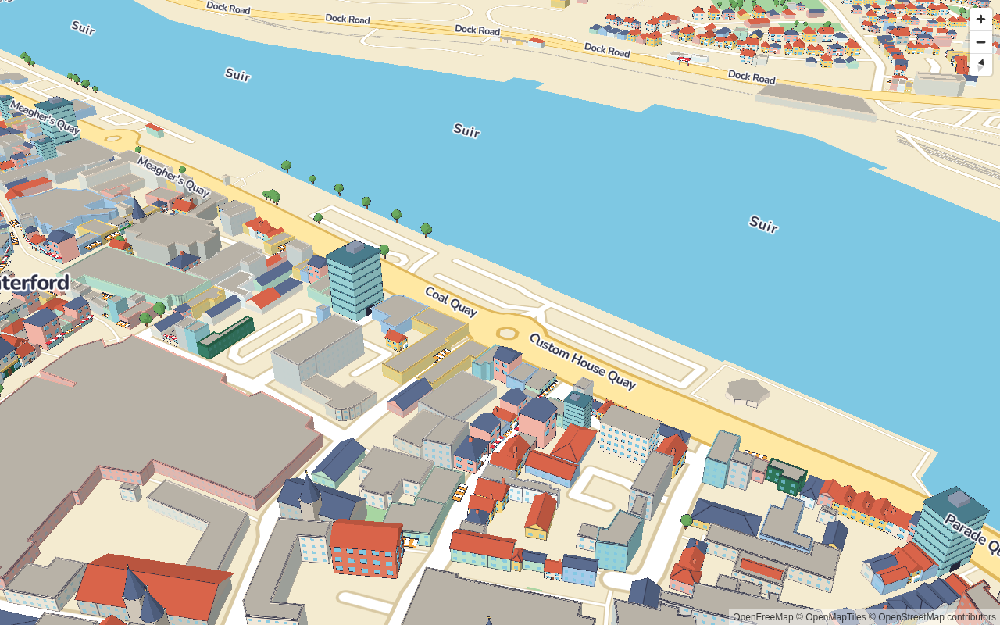
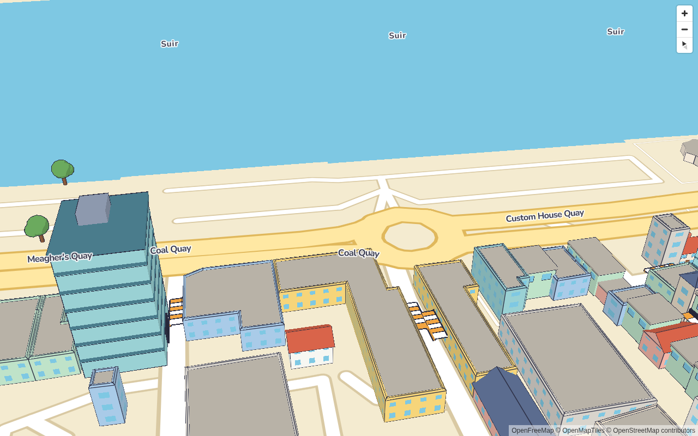
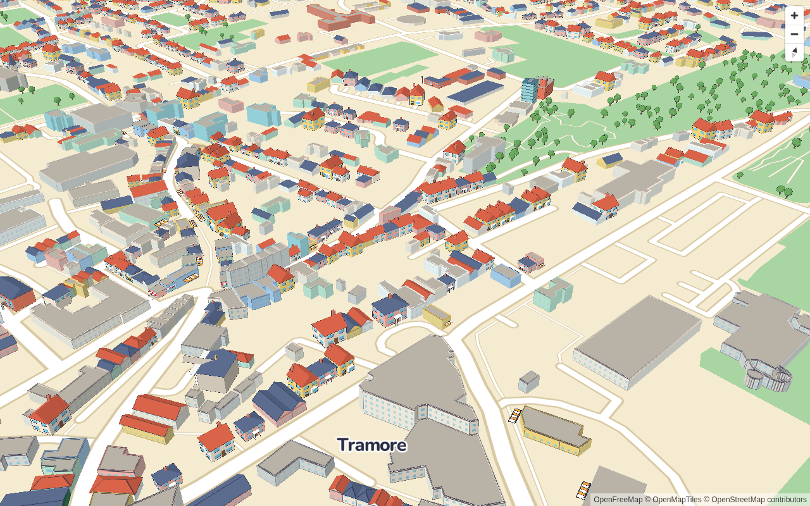
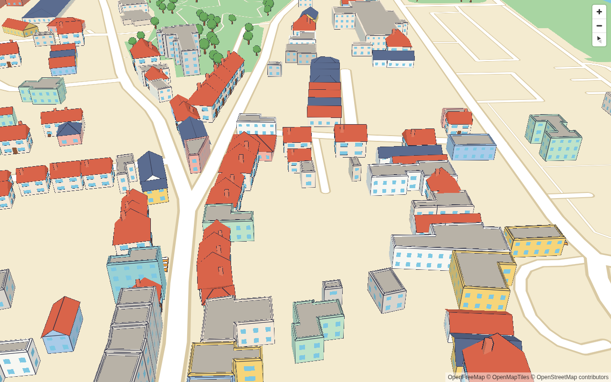

# Rendering: toon shading, hero models and trees

```ts
const toy = new ToyTown({
  data: '/data/waterford.geojson',
  models: '/models/manifest.json', // optional: without it, only procedural buildings are drawn
  theme, // optional, defaults to the built-in theme
}).addTo(map);
await toy.ready; // buildings meshed and the models in view drawn
```

| Waterford z17               | Waterford z18.3               |
| --------------------------- | ----------------------------- |
|  |  |
| **Tramore z17**             | **Tramore z18.3**             |
|    |    |

## The layer

`ToyTownLayer` is a MapLibre custom layer (`renderingMode: '3d'`) that renders one three.js scene
in MapLibre's WebGL context, sharing its depth buffer. It sits under the first symbol layer and
hides the style's flat `toytown-base-buildings` layer while it draws.

- **Scene frame** (`SceneFrame`): everything is in metres east/north/up from the data's centre, on
  MapLibre's spherical earth. Float32 keeps about 1 mm of precision across a whole city in this
  frame.
- **Camera**: each frame, the camera's projection matrix is MapLibre's
  `defaultProjectionData.mainMatrix` (mercator [0, 1] to clip space) × the frame's
  scene-to-mercator transform, multiplied on the CPU in float64. The camera's world matrix is the
  identity. This means standard three.js materials, lights, `InstancedMesh` and frustum culling
  (per chunk) all work unchanged.
- **Chunks** are meshed in their own local metres and placed in the frame with a tiny uniform
  scale for the latitude difference.
- **Globe projection**: 3D only draws in mercator. With `projection: globe`, MapLibre blends to
  mercator as you zoom in (`projectionTransition` reaches 0 at around z12). Until then the layer
  draws nothing and turns the flat base buildings back on.

## Toon shading

- **Materials**: `MeshToonMaterial` with a 5-step gradient map (`lighting.toonSteps`), one
  directional sun, ambient light, and a soft sky/ground hemisphere fill (`lighting.hemisphere`). three's Lambert term divides by π, so the lights
  are scaled by π. A face's brightness is then `ambient + sun × step`: 0.7, 0.85 or 1.0 with the
  defaults. Faces towards the sun show the exact palette hex, because colours are sRGB used as-is
  and the renderer does no output colour-space conversion.
- **Procedural buildings** use the same toon material, extended in `onBeforeCompile`:
  - **Windows**: the phase 3 window strips, drawn from per-vertex wall coordinates.
  - **Ink edges**: a darker tone of each face, nudged towards the theme's ink colour (`#2B2D42`). each face carries barycentric edge coordinates. Quads flag their
    diagonal (the `y` channel, shared by both ends of the diagonal) so it's skipped. The line width
    comes from `fwidth`, so it's constant in pixels (`outline.edgeWidth`). The `smoothstep` upper
    edge is clamped above 0, because constant channels have `fwidth` 0 and GLSL's smoothstep is
    undefined for equal edges.
  - **Distance fade**: from `outline.fadeStart` to `fadeEnd` (metres per pixel), ink fades out and
    windows blend into their average coverage. This removes the z16 moiré from phase 3.
- **Hero models, props and trees**: `MeshToonMaterial` with vertex colours. Each GLB material is
  named by a palette key, and its colour comes from `theme.models.palette`, then the manifest
  palette, so a theme recolours the whole kit without new GLBs. The GLBs have no normals; the
  loader de-indexes them and computes flat normals for crisp faces.
- **Model outlines**: an inverted hull. A second `InstancedMesh` shares the instance matrices and
  draws back faces pushed out `outline.hullWidth` (0.12 m) along smooth, welded normals, in the
  ink colour.

## Placement: fit, decorate, point

Planning is pure and runs in the chunk workers, before meshing (`packages/core/src/placement.ts`).

- **fit**: a building gets its category's hero model instead of procedural geometry when all of
  these hold (defaults in `models.fit`):
  - the category has a model and isn't in `models.exclude`;
  - the building has a `front`, and is a single part without holes;
  - it's **detached** (`detachedOnly`): buildings sharing at least 3 m (or 15% of their outline)
    with a neighbour stay procedural, so terraces look consistent;
  - it fills at least 80% of its minimum rectangle;
  - its frontage:depth ratio matches the model's within 0.35 (natural log);
  - the model, scaled uniformly to fit _inside_ the footprint, needs a scale of 0.75–1.3×;
  - the scaled model covers at least 60% of the footprint;
  - its scaled height is within 1.6× of the building's. Churches, round towers and lighthouses
    are exempt (`heightExempt`), since spires are meant to be tall.

  The model sits at the footprint centroid, turned so its +Z front faces the building's `front`
  bearing. For categories with variants (house, shop and apartment), a stable hash of the OSM id
  picks the base model or one of its variants first, and fit uses that look's footprint.
  Categories named `landmark_*` always fit, with the scale clamped.

- **decorate**: otherwise the procedural building stays and gets its category's props from the
  manifest's `props`:

  | Prop        | For            | Attaches                                                        |
  | ----------- | -------------- | --------------------------------------------------------------- |
  | `awning`    | shop, cafe     | front wall at 2.4 m, scaled to 70% of the frontage              |
  | `red_cross` | hospital       | front wall, just under the eaves                                |
  | `spire`     | church         | tower and spire centred on the front wall line, from the ground |
  | `canopy`    | petrol_station | on the ground, 6 m in front of the front wall                   |

  Eave heights come from the same roof decision the mesher makes.

- **point**: POI nodes outside any footprint (from build-data, with a street-facing `front`) get
  their model when its footprint circle is clear of every building and every other point model.
- **Trees**: every tree point gets the tree model, rotated and sized (0.8–1.25×) by a hash of its
  id, or sized from a tagged `height`.

In Waterford, 9,561 of the 26,870 buildings fit a hero model (mostly houses), 296 buildings get
awnings and 27 get spires, and there are 3,839 trees.

## Open spaces

Areas from build-data (`kind: "area"` and `kind: "track"`, see [build-data.md](build-data.md))
are drawn by MapLibre, not three.js. Four GeoJSON sources (`<id>-areas`, `-stripes`, `-markings`
and `-labels`) feed these layers under the first road layer, so roads, paths and the 3D layer draw
on top:

- `<id>-areas`: a fill per category from `theme.areas.fill`;
- `<id>-area-stripes`: mowing stripes on pitches, from z15;
- `<id>-area-edges`: a thin outline, except on plain grass and tracks;
- `<id>-track-surface` and `<id>-rails-inner|outer`: a running surface along each track (20 m of
  turf for horse racing, 8 m of `trackSurface` otherwise), with a white rail on each side;
- `<id>-area-markings`: pitch lines, from z15.5.

`<id>-area-labels` goes under the style's first label layer. Stripes and markings come from the
pitch's minimum rectangle (only if the pitch fills at least 80% of it). They follow the real
layout (soccer boxes, the GAA 13, 20 and 45 m lines) and shrink on smaller pitches. The label sits
at the point farthest from the area's edges.

Screenshots: [docs/open-spaces/](open-spaces/) (Tramore racecourse, People's Park by day and
night, Walsh Park, Kilcohan greyhound track).

Area props from the kit are placed on the main thread with the trees: `pitch-ends` props go at
both ends of a pitch, facing in and scaled to its width, and `area-centre` props go at the area's
middle if they fit.

## Instancing, lazy loading and levels of detail

There is one `InstancedMesh` per model, variant or prop (plus its hull), filled only with the
instances in visible, loaded chunks. Models load lazily, the first time one of their instances is
in view. Chunks are meshed lazily and freed when out of view; what's drawn depends on zoom. See
[performance.md](performance.md) for the levels, culling and measurements.

Chunks are added and instances filled in a fixed order (chunk key, then model name and id), so
overlapping geometry always draws the same way, whatever order the workers finish in.

## Themes

A theme (a "skin") is JSON in `packages/core/src/themes/`. There are 20 built in:

| Skin        | Look                                                                                                           |
| ----------- | -------------------------------------------------------------------------------------------------------------- |
| `default`   | Warm cream and terracotta, soft toon shading.                                                                  |
| `night`     | Dark blue, glowing yellow windows.                                                                             |
| `sitcom`    | Flat saturated colours, solid black outlines, hard two-band shading.                                           |
| `pastel`    | Soft candy colours, gentle shading, faint tinted edges, no model outlines.                                     |
| `toybox`    | Primary-coloured plastic bricks on a green baseplate, chunky outlines.                                         |
| `retro`     | Four shades of green, like an old pocket game console.                                                         |
| `neon`      | Synthwave night: dark purple, magenta line work, glowing cyan windows.                                         |
| `vintage`   | An old postcard: aged paper, sepia walls, brown ink.                                                           |
| `sketch`    | White buildings, black pen lines, cream paper.                                                                 |
| `blueprint` | Paper blue, white line work on every edge, flat shading.                                                       |
| `autumn`    | Orange trees, golden low light, warm brick.                                                                    |
| `winter`    | Snow on the ground and roofs, evergreens, warm glowing windows.                                                |
| `christmas` | Snow, red and green houses, warm lights.                                                                       |
| `halloween` | Purple dusk, orange glowing windows, bare dark trees.                                                          |
| `shamrock`  | Greens, white and gold.                                                                                        |
| `comic`     | Bold flat colours, black ink, halftone dots in the shadows (effect: `halftone`).                               |
| `handdrawn` | Watercolour washes, wobbly brown ink, paper grain (effects: `wobble`, `paper`).                                |
| `golden`    | Low warm sun, long shadows, haze towards the horizon (effect: `haze`).                                         |
| `voxel`     | Everything built from blocks: the voxel model set, flat-topped buildings with a block grid (effect: `blocks`). |
| `chunky`    | Squash-and-stretch cartoon: the chunky model set, steep tall roofs with deep eaves.                            |

`winter` and `christmas` also have falling snow (effect: `snow`).

The skins after `blueprint` are generated from `default.json` by `scripts/make-skins.py`, which
records each skin's colour mapping; edit it and rerun it to retune them. Pass one to `new ToyTown({ theme })` and `ToyTown.style({ theme })`, or switch live with
`toy.setTheme(name)`. That recolours the toy-town base style in place (`recolourStyle`), restyles
the open-space layers, and re-plans the town: building colours are baked into the chunk meshes
in the worker and model colours into the model geometry, so both are rebuilt in the new theme.

A theme has:

- `style`: the base-map palette. `ToyTown.style({ theme })` recolours the style through an explicit
  map of layer paint properties to palette keys in the style's metadata (`toytown:colors`), so keys
  that share a default colour, like road casing and building outlines, still theme separately.
- `buildings`: wall palettes per category, roofs, flat roofs, windows and `windowGlow` (1 = windows
  shown at full colour whatever the light, for night).
- `lighting`: ambient, sun and toon steps.
- `outline`: ink colour, hull width (0: no model outlines), edge width (0: no edges) and fade.
  `inkShade` and `inkMix` set the edge ink: the face's colour times `inkShade` (default 0.45),
  mixed towards the ink colour by `inkMix` (default 0.35). `sitcom` uses `inkMix: 1` for solid
  black lines.
- `areas`: open-space fills per area category, pitch stripes and markings, track surfaces and
  rails, and label colours. Optional in custom themes, which fall back to the default's.
- `effects` (optional): finishing touches, all off by default.
  - `halftone: { size, strength }`: comic dots in the shadows of buildings and models, in a 45°
    screen-space grid (`size` is the dot spacing in CSS pixels). Drawn in the shaders.
  - `wobble`: 0–1. Building edge lines vary in width along their length, like hand-inked lines.
  - `paper`: 0–1. Paper grain over the whole map, a seeded tile multiplied over the canvas.
  - `haze: { color, amount }`: a gradient from the top of the view, faded in as the map is
    pitched (none looking straight down, full from about 65°).
  - `snow: { density }`: falling flakes on a 2D canvas. Off for users who prefer reduced motion.
  - `blocks`: a block size in metres. Procedural buildings get a block grid in their own frame
    (along and up each wall, across the roof), each block a slightly different shade.

  Paper, haze and snow are DOM overlays above the map canvas and below the controls, so they
  cover the base map and the 3D layer alike.

- `models`: `kit` (optional), a skin model set to use instead of the kit's models (see
  [adding-models.md](adding-models.md#skin-model-sets)); palette overrides for the kit, `glow` palette keys (shown unlit, e.g. `window` at
  night), fit rules and tree sizes.

The night theme uses background `#1B2238` and windows `#FFD166`. Walls and roofs are the day
colours blended 35–45% towards the background, and the moon is lower and cooler than the sun.

`sitcom` is a TV-cartoon look: saturated walls (pink `#F59BBE`, lilac `#C3A0E6`, lime `#A8DE6E`,
sky `#8CD3F5`, yellow `#FFD34E`, orange `#FFB067` on houses), `#1A1A22` ink at 2.2 px with
`inkMix: 1`, 0.3 m model hulls, two toon steps and no fill light. `pastel` is soft: light walls
(`#F7C1CD`, `#D6C4F0`, `#BFE6D2`, `#FBE3A6`, `#C2DDF4`, `#F8D2B8` on houses), three toon steps
with a high ambient, faint tinted edges (`inkShade: 0.72`, `inkMix: 0.2`) and no model outlines.
`winter` puts snow on the ground (`#EEF3F7`) and roofs (`#F8FBFD`), turns trees evergreen
(`#4E7F66`), cools the light and lets windows glow warm `#FFD98A` at half strength.
`blueprint` maps every colour to a shade of paper blue by its lightness, on `#1F4C8A`, and draws
every edge as solid `#F2F8FF` line work (`inkShade: 1`, `inkMix: 1`) over nearly flat shading.
Screenshots: [docs/skins/](skins/).

## Picking

`toy.pick({ x, y })` and `toy.on('click', …)` cast a ray through the last frame's camera (the
inverse projection) into the visible chunk meshes and model instances; outline hulls are skipped.

- **Procedural buildings**: a hit maps back to its OSM id through the `aBuilding` vertex attribute
  and the chunk's id list.
- **Models, props and trees**: an instance hit maps back to its placement, because each instance
  buffer keeps its placements in order.

The result includes the category, name and height from the data, and a link to
openstreetmap.org.
