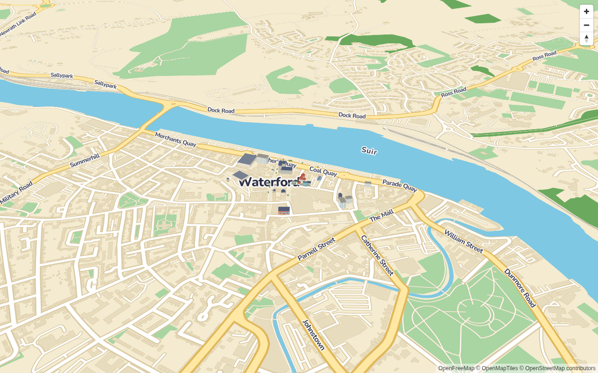
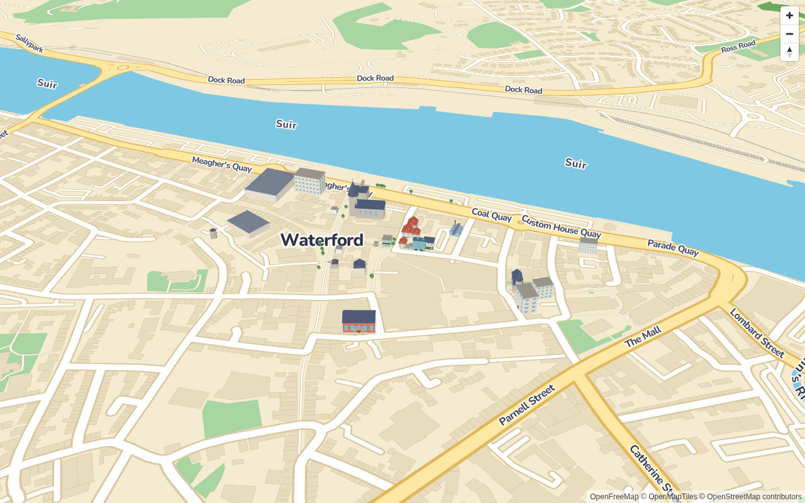
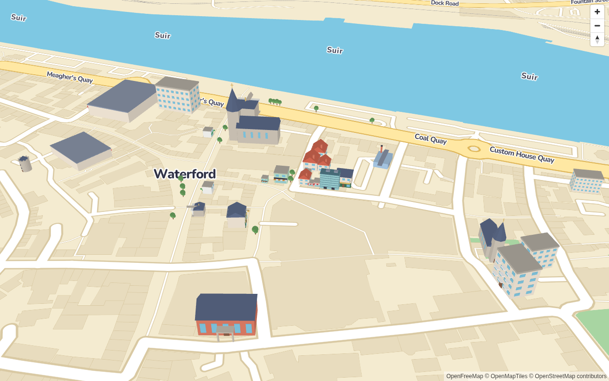
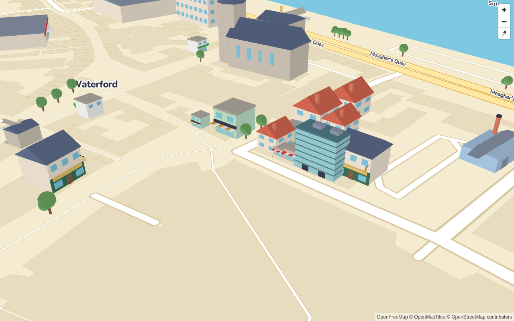
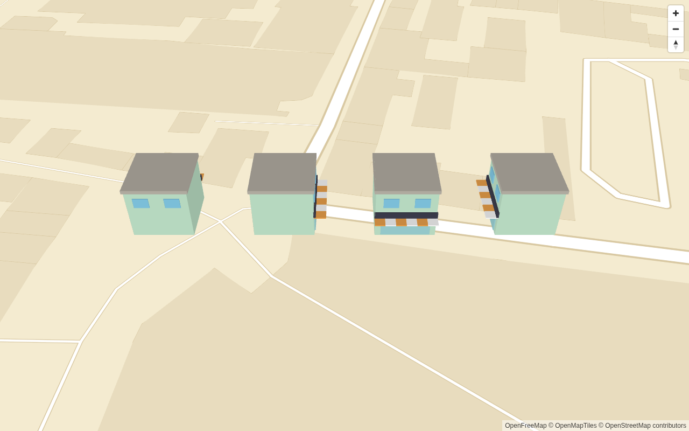

# Phase 2.5 visual spike

**Status: awaiting review.** This is a throwaway check that the toy-town look works before building
the custom three.js renderer. If phases 3–4 prove too hard, this becomes the fallback v1 renderer.

`examples/spike` renders the phase 1 style with deck.gl's `ScenegraphLayer` (through
`MapboxOverlay`, interleaved). It places 28 kit models on real classified buildings from the phase 2
Waterford data around the Quay and city centre: each nearest-to-centre building with a model
category, capped per category. It also places 15 mapped trees. Each model sits at its footprint
centroid and is scaled uniformly to the footprint's minimum rotated rectangle, clamped to
0.6–1.6×, as phase 4's `fit` rule will do. It is rotated so its front (+Z) faces the building's
`front` bearing.

```sh
pnpm build && pnpm --filter @toytown/example-spike dev
# ?zoom=16&pitch=55&bearing=0   ?calibrate=1   ?calibrate=1&lighting=ambient
SPIKE_SCREENSHOTS=1 pnpm test:e2e spike    # regenerates these images
```

| z15                    | z16                    | z17                    |
| ---------------------- | ---------------------- | ---------------------- |
|  |  |  |

Close-up (z18.5, pitch 60, bearing −30): 

## Findings

### Colour: fixed in the generator

The first renders looked grey and washed out. The glTF spec says `baseColorFactor` is **linear**,
but `generate_models.py` wrote the sRGB hex values straight in (hex/255). Every spec-compliant
renderer (deck.gl/luma.gl, three.js, Blender, Godot) therefore showed each palette colour lighter
and less saturated than its hex, e.g. `#F2A541` as about `#F9D28A` under neutral light.

The fix, in `generate_models.py`:

- The palette is decoded to linear before writing materials (`linear_rgba`).
- trimesh stores factors as 8-bit, which loses precision in linear space, so the exact floats are
  patched into the GLB's JSON chunk after export (`exact_colors`).
- `manifest.json` still stores the palette as sRGB hex.
- A new kit test checks every material's factor equals the decoded palette colour to 1e-4.

Verification: `calibrate-colour.png` uses ambient light only at intensity π, which cancels the PBR
1/π diffuse term. Faces render within 5–11/255 per channel of their palette hex. The remainder is
luma.gl's `pow(1/2.2)` output approximation and a little Fresnel. Before the fix, the same setup
predicted errors of up to 73/255.

The spike's lighting was then set to ambient 0.7π plus a sun at 0.5π, so lit faces sit near 1.0–1.2×
the palette and shaded faces near 0.7×. Phase 4 swaps materials for toon materials coloured through
the theme, so the GLB factors matter mostly to other consumers of the kit, but those now get the
right colours.

### Orientation: correct, no change

`calibrate-front.png` shows four shops facing N, E, S and W (left to right), with the camera
looking north. Each awning (the model's front) is on the expected side. The convention holds:
glTF Y-up needs roll 90° in deck's Z-up world, and yaw `180 − front` turns +Z to the front bearing.
That's a renderer-level axis conversion, not a per-model fix, so nothing in the generator changed.



### Scale: models are right; the problems are fit and styling

- The models are correctly in metres. A house is about 8.6 m wide, a church spire about 32 m.
- **At z15 the models are specks next to the exaggerated roads.** This is a styling and LOD choice:
  phase 5 already shows hero models only from z16. A per-zoom exaggeration factor in the renderer
  could make them read better at z15–16.
- **Small city-centre plots.** Many centre footprints are narrow terraced plots of 30–60 m², so
  even at the 0.6× clamp an office (14.6×12.6 m) or café overflows onto its neighbours (see the
  cluster near Coal Quay). This is what phase 4's `fit` vs `decorate` rule is for: only place a
  hero model when the footprint is within tolerance, otherwise keep the procedural building and add
  props.
- **Aspect.** Models are rotated to face the street, so when a building's front is on its short
  side, the model's width runs along the short side. Phase 4's fit check should compare aspect
  after rotation.

### Classification, seen in 3D

- Several centre buildings are `house` (the gabled detached-house model) because OSM tags them
  `building=house` or the small-building heuristic catches them. In a Georgian terraced street
  they'd read better as `terraced_house`. It may be worth a tag-map rule using adjacency or
  footprint shape later; not needed for the spike.
- Trees are to scale (6.4 m) and read as small. A toy look may want them exaggerated, in the same
  per-zoom way as buildings.

## Decisions for review

1. Approve the look (colours, model style, lighting), or note changes.
2. Should models be exaggerated at lower zooms (e.g. 1.5× at z16, 1× at z18), or stay strictly
   metric?
3. The colour fix changed every GLB's material factors. The manifest `version` stays `1`, because
   the documented conventions (Y-up, metres, +Z front, origin, one material per palette key) are
   unchanged and this was a bug against the glTF spec. Bump it if you'd rather treat it as a
   convention change.
