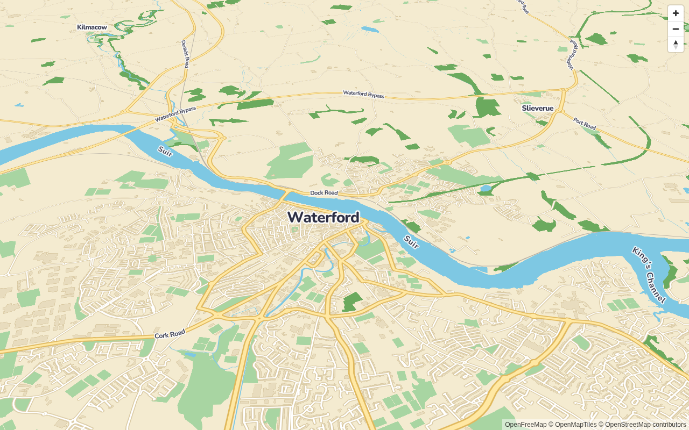
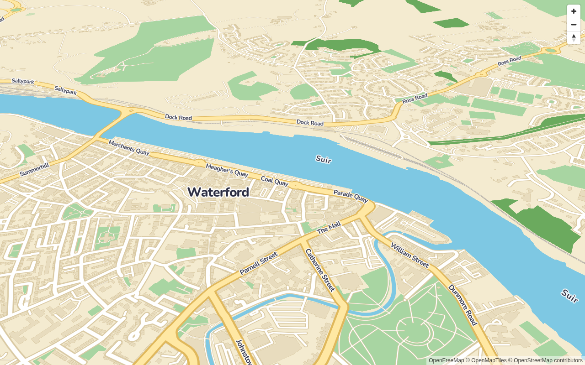
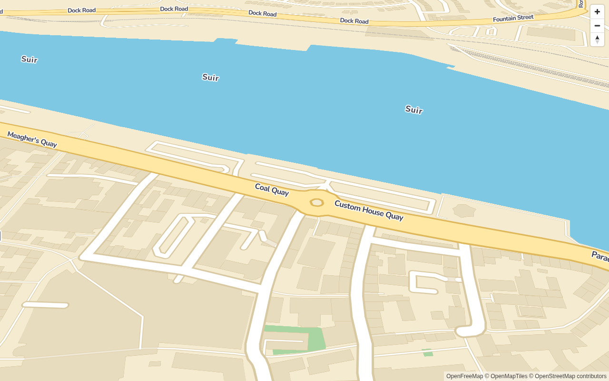
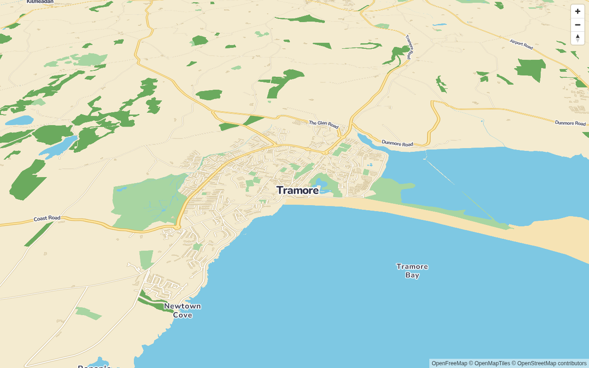
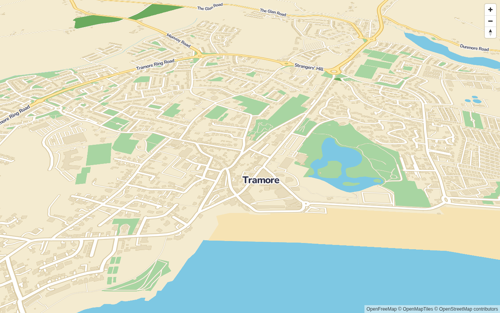
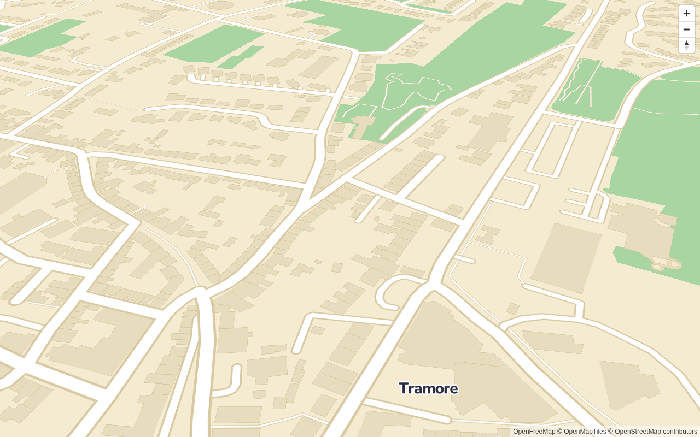

# The toy-town base style

`packages/core/src/style/toytown.json` is a MapLibre style (spec v8) over vector tiles in the
[OpenMapTiles schema](https://openmaptiles.org/schema/). By default it uses
[OpenFreeMap](https://openfreemap.org/), which needs no API key.

```ts
import { toytownStyle } from 'toytown-gl';

new maplibregl.Map({ container: 'map', style: toytownStyle() });

// Other OpenMapTiles-schema tiles: a TileJSON URL, or {z}/{x}/{y} templates.
toytownStyle({ tiles: 'https://example.com/tiles.json' });
toytownStyle({ tiles: ['https://example.com/{z}/{x}/{y}.pbf'], maxzoom: 14 });
toytownStyle({ glyphs: '/fonts/{fontstack}/{range}.pbf', attribution: 'My tiles' });
```

`toytownStyle()` returns a fresh copy every time, so you can edit it safely. If you replace the
attribution, "© OpenStreetMap contributors" is appended when it's missing, because the ODbL
requires it.

## Palette

The palette is stored in the style's `metadata["toytown:palette"]`, and every colour in the style
comes from it (a unit test enforces this).

| Key                 | Hex       | Used for                                              |
| ------------------- | --------- | ----------------------------------------------------- |
| `land`              | `#F4EBD0` | background                                            |
| `water`             | `#7EC8E3` | water areas, rivers, streams                          |
| `grass`             | `#A8D5A2` | parks, grass, gardens, pitches, cemeteries            |
| `wood`              | `#6BAA5E` | woods and forest                                      |
| `sand`              | `#F6E3B4` | sand and beaches                                      |
| `road`              | `#FFFFFF` | minor roads, service roads, paths, rail sleepers      |
| `road_casing`       | `#D9C9A3` | minor road and path casing                            |
| `major_road`        | `#FFE8A3` | motorway, trunk, primary, secondary                   |
| `major_road_casing` | `#E0B85C` | major road casing                                     |
| `rail`              | `#B8B2A7` | rail and transit                                      |
| `label`             | `#2B2D42` | all label text                                        |
| `label_halo`        | `#FFFFFF` | all label halos                                       |
| `building`          | `#E8DCBE` | flat 2D building footprints (not in the plan palette) |
| `building_outline`  | `#D9C9A3` | 2D building outlines (same as `road_casing`)          |

## Look

- **Lines:** every road, path, rail and waterway line has round caps and joins. Rail sleepers are
  the exception: they are a dashed white overlay, which needs butt caps to show the dashes.
- **Road widths** are exaggerated with an exponential zoom curve. At z16, major roads are 17 px
  wide (25 px with casing) and minor roads 11 px (16 px). Tunnels are drawn at 50% opacity.
- **Labels are minimal:** towns and villages (`place` class `city`, `town`, `village`), names of
  major roads, and water bodies (`water_name` points and lines, and river names from `waterway`).
  There are no POI icons and no sprite. Line labels use `text-pitch-alignment: viewport` so they
  stay readable at high pitch.

## Font: Nunito

Labels use [Nunito](https://fonts.google.com/specimen/Nunito), a Google Font under the SIL Open
Font License. Its rounded terminals suit the toy look. The glyphs come from the
[VersaTiles](https://versatiles.org/) glyph server
(`https://tiles.versatiles.org/assets/glyphs/{fontstack}/{range}.pbf`), which is free, needs no
key and sends `Access-Control-Allow-Origin: *`. Font stacks: `nunito_extrabold` for places,
`nunito_bold` for everything else.

Alternatives considered:

- **OpenFreeMap's glyph server** only has Noto Sans, which isn't rounded.
- **fonts.openmaptiles.org** appears to list Nunito, Varela Round and Fredoka, but it returns the
  same HTML redirect page for every font name, including made-up ones. It no longer serves glyphs.
- **Self-hosting glyph PBFs** built from Nunito would remove the third-party dependency. We can do
  that later if VersaTiles becomes a problem; the `glyphs` option already allows it.

The known gap is that VersaTiles' Nunito covers Latin, Greek and Cyrillic. Scripts it lacks, such
as Arabic and Devanagari, render no labels. CJK falls back to MapLibre's local ideograph font.
Pass a different `glyphs` URL for those regions.

## Hiding the base buildings

The style draws flat building footprints in the `toytown-base-buildings` layer
(`BASE_BUILDING_LAYER_ID`), so the map still looks complete without the 3D layer. The 3D layer
hides it while it's active:

```ts
import { setBaseBuildingsVisible } from 'toytown-gl';
setBaseBuildingsVisible(map, false); // when the 3D layer is added
setBaseBuildingsVisible(map, true); // when it is removed
```

## Screenshots

Taken at pitch 55 by `DOCS_SCREENSHOTS=1 pnpm test:e2e`:

| Town      | z13                          | z15                          | z17                          |
| --------- | ---------------------------- | ---------------------------- | ---------------------------- |
| Waterford |  |  |  |
| Tramore   |    |    |    |
